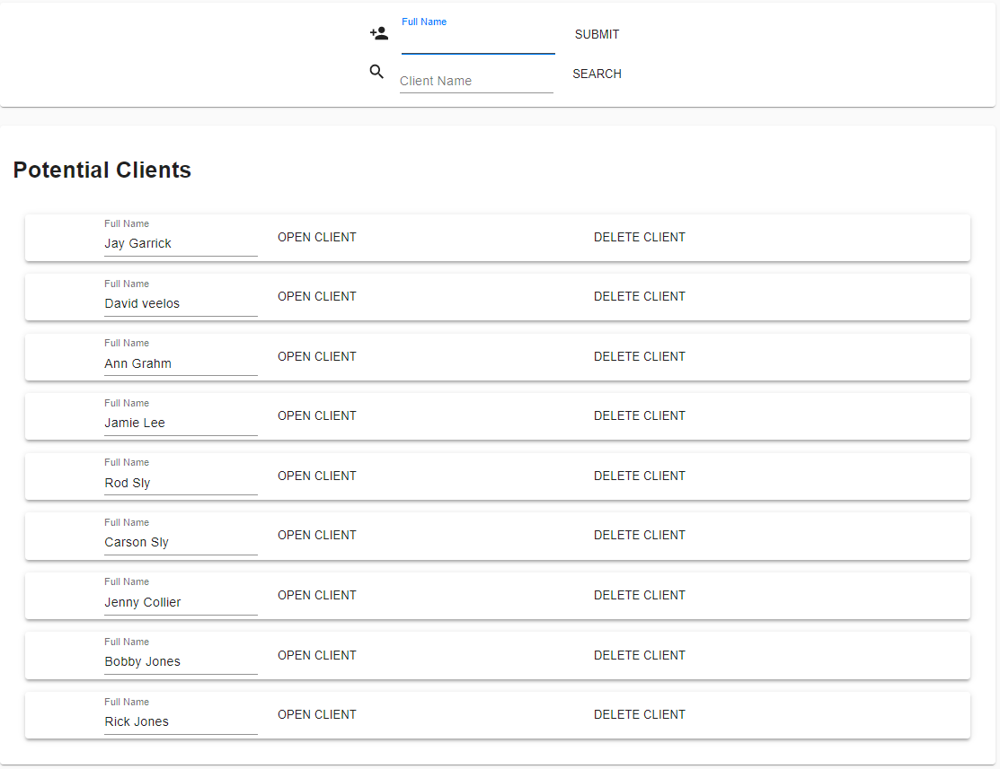

Description:
    This code is built for World Relief https://worldreliefspokane.org/ to help with organizing their client system for people who wish to become United States citizens. We have built and access portal to allow them to interface with a database that contains all potentail clients that they may have, the data base also contains the documentation for all the potential clients so it may be verified that they are ready to be picked up by a lawyer to try for citizenship.

Client Page:
    The Client page allows for a client to be added using their full name and upon clicking the submit button the Name is sent to the potential clients list and a upon clicking the OPEN CLIENT button the file tree is shown with the clients files. After clicking on a clients open button and veiwing their files tree the arrows on he left side can be used to expand the tree to view underlying requirements and if a file is nessecary then an upload file button will appear to allow an object to be placed in that section, if a file is uneeded then a checkbox will appear which can be clicked to show that the requirement has been completed .Upon clicking the DELETE CLIENT button an alert is shown and the user must accept the alert to actually remove the client from the Potential Client list.There is also a search bar under the client creation bar which allows you to search through the database for a certain client.
    

User Account Page:
    The User Account Page allows for a user to change their name and password for their account if they so wish to. To get to the page a user must click on the person shaped icon at the top right of the screen on the dashboard strip. To use the Account page to change their first and/or last name a user must only enter what they wish to be called in the corresponding box and then hit the submit key. To change a password a user must enter their new password in the password box and then must reenter it in the confirm password box and then hit the submit button, when the user next logs on their password will have changed to the new one.
    
    
    
Users Page:
    The Users Page allows a user to see all the users on the database and their first and last name as well as if they are active and set to an admin account. To get to the Users Page you must click on the Users button on the tab located on the left side of the screen. Users are also allowed to take actions like deleting themselves and other users if they are an admin. but if a user is not an admin then they are only allowed to delete themselves.
    

Form Editor Page:
    The Form Editor Page allows an Admin to change the required forms that a client has in their file tree. To get the the Form Editor Page a user must click the Form Editor button located on the tab on the left side of the screen. To use the Form Editor to add a new field a user must click on the ADD FIELD button on the upper right of the screen and then an empty node will be created and from there the node may be selected and the field type changed to what the user would like. The fields may also be selected and then if the DELETE THIS button is pushed an alert will pop up and DELETE must be entered in the alert to delete the field.
    

The Left Hand Tab:
    The Left Hand Tab has the buttons Client, Users and Form Editior which are talked about in their corresponding sections but it also includes the sections Expiring Soon and My Clients, The Expiring Soon will show a user a client that has been untocuhed for one month of time, upon editing a client the timer will reset but if they remain untouched they will be auto deleted from the database. The My clients tab lists all recent clients viewed if they are your client.
    

Logout:
    The logout button allows a user to return to the sign in page to either sign in a new user or sign off for the night. To Logout go to the upper right of the page and click the button on the dashbord stripe that looks like an arrow on a square.
    
